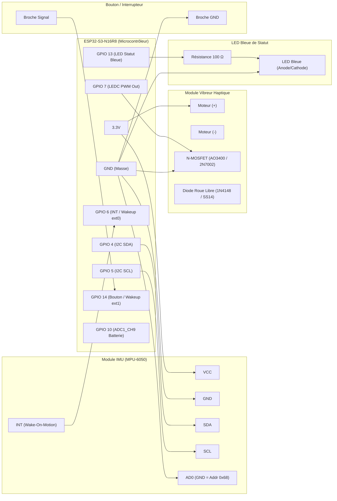

# health-kicks-esp32-s3 : Firmware Embarqué Chaussure Connectée

Ce dépôt contient le firmware unifié pour la chaussure connectée **HealthKicks**, conçu pour le microcontrôleur **ESP32-S3-N16R8** (16 MB Flash Quad/Octal, 8 MB PSRAM Octal). Il remplace l'ancienne architecture hybride Raspberry Pi + Arduino Nano.

---

## 1. Câblage Matériel & Broches (ESP32-S3-N16R8)

### A. Avertissement Critique : Mémoire Octal SPI (N16R8)
> [!CAUTION]
> Sur les modules ESP32-S3 équipés de PSRAM et Flash Octale (N16R8), les broches **GPIO 33, 34, 35, 36 et 37** sont directement câblées en interne au bus mémoire Octal SPI.
> **IL EST FORMELLEMENT INTERDIT D'UTILISER CES BROCHES EN TANT QUE GPIO GÉNÉRAUX.** Tout raccordement sur ces broches corrompt la mémoire et cause un arrêt immédiat du CPU.

### B. Tableau Synthétique des Broches

| Composant | Broche Composant | Broche ESP32-S3 | Type / Fonction | Remarques |
| :--- | :--- | :--- | :--- | :--- |
| **MPU-6050 (IMU)** | VCC | 3V3 | Alimentation | Régulée 3.3V |
| **MPU-6050 (IMU)** | GND | GND | Masse | Masse commune |
| **MPU-6050 (IMU)** | **SDA** | **GPIO 4** | I2C Data (RTC IO 4) | Pull-up 4.7 kΩ vers 3.3V |
| **MPU-6050 (IMU)** | **SCL** | **GPIO 5** | I2C Clock (RTC IO 5) | I2C Fast Mode 400 kHz, pull-up 4.7 kΩ |
| **MPU-6050 (IMU)** | AD0 | GND | Adresse I2C | Fixe l'adresse à `0x68` |
| **MPU-6050 (IMU)** | INT | **GPIO 6** | GPIO Interrupt | Optionnel (Wake-on-motion) |
| **Vibreur Haptique** | Gate (MOSFET) | **GPIO 7** | LEDC PWM (0-255) | Fréquence 10 kHz, Timer 0 |
| **LED Bleue Statut** | Anode (+ R 100 Ω)| **GPIO 13** | Output (Actif Haut) | BLE (appairage/connecté/déconnecté), Calibration, Studio |
| **Bouton Appairage** | Contact | **GPIO 14** | RTC IO 14 (Input) | Pull-up interne, actif bas (GND), réveil `ext1` |
| **LED RGB Statut** | Data In | **GPIO 48** | RMT / WS2812 | LED RGB embarquée sur DevKitC-1 |
| **Mesure Batterie** | Diviseur $V_{bat}$ | **GPIO 10** | ADC1_CH9 | Diviseur 2x 100 kΩ ($V_{bat}/2$) |
| **Octal Flash/PSRAM**| - | **GPIO 33 à 37** | **INTERDIT** | **Dédié Flash & PSRAM Octal SPI** |
| **Strapping Pins** | - | **GPIO 0, 45, 46** | Boot Strapping | Ne pas connecter de charge externe |
| **USB Natif CDC** | USB D- / D+ | **GPIO 19, 20** | USB CDC/JTAG | Moniteur série & flash |

### C. Schéma Fonctionnel Global d'Interconnexion



    %% Signaux IMU
    GPIO4 <--> IMU_SDA
    GPIO5 --> IMU_SCL
    IMU_INT --> GPIO6

    %% Signal Vibreur
    GPIO7 --> MOSFET
    MOSFET --> MOT_NEG

    %% Signal Bouton
    SW_1 --> GPIO14
```

### D. Schéma Électronique Détaillé des Composants

```text
==================================================================================================
                              SCHÉMA DE CÂBLAGE COMPLET - ESP32-S3
==================================================================================================

1. MODULE IMU (MPU-6050) - BUS I2C ET INTERRUPTION WOM
--------------------------------------------------------------------------------------------------
   ESP32-S3                                                Module MPU-6050
  +-----------+                                           +---------------+
  |      3.3V |------------------------------------------>| VCC           |
  |       GND |-------------------+---------------------->| GND           |
  |           |                   |                       | AD0           | (GND = Addr 0x68)
  |           |       3.3V        |                       |               |
  |           |        |          |                       |               |
  |           |       [4.7k]      |                       |               | (Résistance Pull-up I2C)
  |    GPIO 4 |--------+--------------------------------->| SDA           |
  |           |        |                                  |               |
  |           |       3.3V                                |               |
  |           |        |                                  |               |
  |           |       [4.7k]                              |               | (Résistance Pull-up I2C)
  |    GPIO 5 |--------+--------------------------------->| SCL           |
  |           |                                           |               |
  |    GPIO 6 |<------------------------------------------| INT           | (Réveil WOM / ext0)
  +-----------+                                           +---------------+


2. MODULE VIBREUR HAPTIQUE (DISCRET OU BREAKOUT)
--------------------------------------------------------------------------------------------------
   ESP32-S3                                                Étage de Puissance Moteur
  +-----------+                                           +3.3V (ou VBAT)
  |           |                                             |
  |           |                                             +--------+
  |           |                                             |        |
  |           |                                           +---+    +---+
  |           |                                           | + |    | A | Diode de roue libre
  |           |                                    Moteur | M |    |   | 1N4148 / SS14
  |           |                                   Vibreur | - |    | K | (Cathode vers +3.3V)
  |           |                                           +---+    +---+
  |           |                                             |        |
  |           |                                             +--------+
  |           |                                             |
  |           |                                           D | (Drain)
  |           |              100 Ω                       +--+
  |    GPIO 7 |-------------[\/\/\]-----+--------------G |  | N-MOSFET (AO3400 / 2N7002)
  |           |                         |                +--+
  |           |                       [100k]              | S (Source)
  |           |                      Pull-down            |
  |       GND |-------------------------+-----------------+
  +-----------+                                           |
                                                         GND

   *Note pour module vibrant pré-assemblé (ex: breakout Grove / Keyes) :*
   - VCC -> 3.3V
   - GND -> GND
   - IN / SIG -> GPIO 7


3. BOUTON POUSSOIR / INTERRUPTEUR (APPAIRAGE & RÉVEIL DEEP SLEEP)
--------------------------------------------------------------------------------------------------
   ESP32-S3                                                Bouton Poussoir
  +-----------+                                           +---------------+
  |   GPIO 14 |------------------------------------------>| Contact A     | (Actif bas)
  |       GND |------------------------------------------>| Contact B     | (Pull-up interne active)
  +-----------+                                           +---------------+


4. LED BLEUE DE STATUT (BLE, CALIBRATION, STUDIO)
--------------------------------------------------------------------------------------------------
   ESP32-S3                                                LED Bleue + Résistance Série
  +-----------+                                           
  |   GPIO 13 |----------------[\/\/\]------------------->| Anode (+)     | LED Bleue
  |           |                 100 Ω                     | Cathode (-)   |
  |       GND |------------------------------------------>|               |
  +-----------+                                           +---------------+


5. DIVISEUR DE TENSION MESURE BATTERIE (OPTIONNEL)
--------------------------------------------------------------------------------------------------
   ESP32-S3                                                Batterie LiPo (3.7V - 4.2V)
  +-----------+                                           +VBAT
  |           |                                             |
  |           |                                           [100k] (1%)
  |           |                                             |
  |   GPIO 10 |---------------------------------------------+ (Tension max = VBAT / 2 = 2.1V)
  |           |                                             |
  |           |                                           [100k] (1%)
  |           |                                             |
  |       GND |---------------------------------------------+
  +-----------+                                            GND
==================================================================================================

### E. Recommandations de Montage & Transistor Vibreur
Pour garantir la pleine saturation du transistor avec le niveau logique 3.3V de l'ESP32-S3 :
- Utiliser un MOSFET N-Channel à très bas seuil de déclenchement (*Logic-Level* $V_{gs(th)} < 1.8\text{V}$, idéalement **AO3400**, **IRLML2502** ou **2N7002** à faible $V_{gs(th)}$).
- **Gate** : Résistance de limitation de 100 Ω connectée à **GPIO 7**.
- **Pull-down Gate** : Résistance de 100 kΩ entre Gate et GND pour éviter toute impulsion au démarrage ou en Deep Sleep.
- **Diode de roue libre** : Diode de redressement rapide (1N4148 ou diode Schottky SS14/BAT43) placée en parallèle inverse aux bornes du moteur pour absorber les surtensions inductives.
- **Module IMU MPU-6050** : Si le module MPU-6050 intègre déjà des résistances de pull-up I2C internes de 4.7 kΩ vers 3.3V, les résistances externes peuvent être omises. La broche `AD0` doit impérativement être reliée à `GND` pour fixer l'adresse I2C à `0x68`.

### F. Comportement & Signaux Visuels de la LED Bleue (GPIO 13)

La LED de statut bleue (`LedDriver`) fonctionne selon une machine à états non-bloquante avec priorisation des états matériels et logiciels :

| Événement / État | Comportement LED (GPIO 13) | Fréquence / Temporisation | Objectif & Contexte |
| :--- | :--- | :--- | :--- |
| **Calibration IMU en cours** | **Allumée Fixe (Solid ON)** | Continue pendant la capture | Signale l'immobilité requise pour le calibrage des offsets |
| **Capture Studio en cours** | **Allumée Fixe (Solid ON)** | Continue pendant l'enregistrement | Signale la capture cinématique brute haute fréquence (54 Hz) |
| **BLE en attente d'appairage** | **Clignotement régulier** | $2\,\text{Hz}$ (250 ms ON / 250 ms OFF) | Mode *Advertising*, prêt pour connexion smartphone |
| **BLE Connecté** | **Allumée Fixe 2 secondes** | Fixe 2000 ms puis extinction (OFF) | Confirmation visuelle de liaison, puis économie batterie |
| **BLE Déconnecté** | **Double flash rapide** | 2 pulses (100 ms ON / 100 ms OFF) | Alerte de perte de liaison avant reprise d'appairage |


---

## 2. Compilation & Flash avec PlatformIO

Ce projet utilise [PlatformIO](https://platformio.org/).

### Commandes de base :
```bash
# Compilation du firmware
pio run

# Flash sur l'ESP32-S3
pio run --target upload

# Ouverture du moniteur série USB CDC (115200 bauds)
pio run --target monitor
```

---

## 3. Conformité aux Contrats GATT BLE

Le serveur BLE implémente les spécifications contractuelles définies dans `contracts/ble_gatt_specs.md` :
- **Service Footwear** : `7a5a0001-c529-4d64-8848-18e5904de22a`
- **Activity Detection** : `7a5a0002-...` (READ, NOTIFY - 7 octets Big-Endian)
- **Haptic Command** : `7a5a0003-...` (WRITE, WRITE_NR - 4 octets Big-Endian)
- **Studio Control** : `7a5a0004-...` (WRITE, NOTIFY - ASCII UTF-8)
- **Studio Data Burst** : `7a5a0005-...` (NOTIFY - Paquets MTU-adaptés avec CRC32)

---

## 4. Edge AI : Export et Transpilation du Modèle (`tools/export_model_to_c.py`)

Le firmware embarque directement le modèle d'inférence d'activité (Random Forest scikit-learn) transpilé en C pur header-only (`include/activity_model_generated.h`) via `m2cgen`.

### A. Prérequis Python
```bash
pip install m2cgen joblib scikit-learn numpy
```
*(ou utiliser l'environnement virtuel avec `uv run`)*

### B. Utilisation du script d'export
Pour convertir un modèle entraîné `.joblib` en header C++ :

```bash
# Export standard (chemins par défaut : scripts/models/activity_classifier.joblib -> include/activity_model_generated.h)
python tools/export_model_to_c.py

# Export avec chemins personnalisés
python tools/export_model_to_c.py --model path/to/model.joblib --output include/activity_model_generated.h
```

### C. Options disponibles
* `--model <chemin>` : Chemin vers le fichier `.joblib` du modèle entraîné (Recherche automatique par défaut dans `scripts/models/`, `../health-kicks/scripts/models/`, `../health-kicks-edge-script/models/`).
* `--output <chemin>` : Chemin du fichier header C généré (Défaut : `include/activity_model_generated.h`).

### D. Workflow après mise à jour du modèle
1. Entraîner ou ajuster le modèle scikit-learn (Random Forest / Decision Tree).
2. Lancer `python tools/export_model_to_c.py --model <chemin_modele.joblib>`.
3. Recompiler le firmware avec `pio run`.


